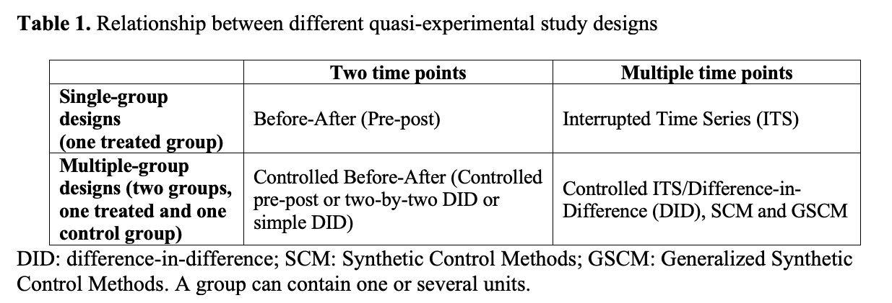

```{r setup, include=F}
knitr::opts_chunk$set(
	message = T,
	warning = T,
	#include = FALSE,
	echo = TRUE
)
if (!require("pacman")){
  install.packages("pacman", repos = 'http://cran.us.r-project.org')
} # a nice package to load several packages simultaneously


p_load("tidyverse","magrittr","broom",        #manipulate data
       "cleaR",                               #clearing workspace
       "here",                                #directory managment
       "Synth", "gsynth",                     #synthetic control
       "panelView", "lme4", "estimatr",       #multi-level model
       "gtsummary")                           #for tables

p_load("flextable",                         # For tidying up regression output
        "broom.mixed",                      # For tidying up multilevel output
        "kableExtra",                       # For nice tables
        "knitr",                            # For nice tables
        "rmarkdown")   

p_load_gh("datalorax/equatiomatic")         # For nicely presenting regression coefficients

```

# Relationship between different quasi-experimental designs


[Nianogo RA, Benmarhnia T, O'Neill S. A comparison of quasi-experimental methods with data before and after an intervention: an introduction for epidemiologists and a simulation study. Int J Epidemiol. 2023 Oct 5;52(5):1522-1533.](https://pubmed.ncbi.nlm.nih.gov/37023467/)

# Loading the data  

Let's load the data   

```{r load_data, warning=F, message=F}
mydata <- read_csv(here("data", "sim_data.csv"))
```

You can either use the data that we modified before in part 1 or you can modify the raw data here   

```{r }
year_policy <- 2000

mydata <- mydata %>% 
  mutate(year_rec = year - year_policy,
         post     = ifelse(year>=year_policy,1,0),
         treated  = ifelse(state %in% c("Alabama",  "Alaska", 
                                        "Arizona", "Arkansas", "California"), 1,0),
         treatedpost = treated*post)
```

# Difference-in-Difference and related designs   
## Pre-post designs 

Pre-post analysis (before-after) no control group: One state, two time points  

- Subset the data to California and the years 1995 and 2005. You can use the `dplyr::filter()` function    
- Preview the data. You can use the `base::head()` function  
- Plot the data. You can use the `ggplot2::ggplot()` function   
- Fit a linear model to estimate the effect of the policy on the outcome y  
$$E(Y|  T=t,C=c) = β_0  + β_T T + β_C C$$
where T is an indicator for time period (T=0, before the policy was implemented, T=1, after the policy has been implementation) and C is a set of unit-time varying covariates that affects (and not affected by) the outcome and which represents the set of covariates sufficient for confounding control   

- Discuss potential problems  

**Create the data**  

```{r prepost}
dt <- mydata %>%
  filter(state=="California",
         year %in% c(1995, 2005)) 
```

**Preview the data**   

```{r}
paged_table(head(dt))
```

**Plot the data**  

```{r}
dt %>% 
  ggplot(aes(x=year, y=y, group=state, color = state)) + 
  labs(title = paste("Outcome by year"),
       x = "Year", 
       y = "Outcome",
       colour = "Treatment") +
  geom_line() +
  geom_point() +
  geom_vline(xintercept = year_policy, lty=2) +
  theme_bw() +
  theme(plot.title = element_text(hjust = 0.5)) 
```

**The following model is used to estimate the effect of the policy on the outcome y**  

```{r echo=FALSE, error=TRUE, message=TRUE, warning=TRUE}
fit <- lm(y ~ post + xi + xt + xit, data=dt)

extract_eq(fit, use_coefs = F)

fit %>% 
  tidy() %>% mutate_if(is.numeric, round, 2) %>% flextable()
```

**Potential problems**  
- The selected years before and after the policy are picked arbitrarily  
- It is impossible to get standard errors  
- It is impossible to adjust for covariates  
- This model would be wrong if there is history bias (which can occur when the effects of time-varying confounding from unexpected events or co-interventions (i.e. time shock) mix with the effects of the intervention of interest)

**Conclusion**  
- As expected the estimate is biased and standard errors inestimable


## Controlled pre-post designs  

Pre-post analysis (before-after) with a control group: Two states, two time points   

- Subset the data to California and Georgia and the years 1995 and 2005. You can use the `dplyr::filter()` function    
- Preview the data. You can use the `base::head()` function  
- Plot the data. You can use the `ggplot2::ggplot()` function   
- Fit a linear model to estimate the effect of the policy on the outcome y  
$$E(Y| A=a,T=t,C=c) = β_0  + β_A A + β_T T +\beta_{AT}AT + β_C C  $$
Where T is an indicator for time period (T=0, before the policy was implemented, T=1, after the policy has been implementation), A is an indicator for the treatment variable (A=0 if the unit did not receive the policy, A=1 if the unit received the policy), A*T is an interaction between the treatment indicator and the time indicator and C is a set of unit-time varying covariates that affects (and not affected by) the outcome and which represents the set of covariates sufficient for confounding control     

- Discuss potential problems


**Create the data**

```{r ctrl_prepost}
dt1 <- mydata %>% 
  filter(state=="California" | state=="Georgia",
         year %in% c(1995, 2005))
```

**Preview the data**  

```{r}
paged_table(head(dt1))
```

**Plot the data** 

```{r}
dt1 %>% 
  ggplot(aes(x=year, y=y, group=state, color = state)) + 
  labs(title = paste("Outcome by year"),
       x = "Year", 
       y = "Outcome",
       colour = "Treatment") +
  geom_line() +
  geom_point() +
  geom_vline(xintercept = year_policy, lty=2) +
  theme_bw() +
  theme(plot.title = element_text(hjust = 0.5)) 
```

**The following model is used to estimate the effect of the policy on the outcome y**  

```{r echo=FALSE, error=TRUE, message=TRUE, warning=TRUE}
fit <- lm(y ~ treated*post, data=dt) 

extract_eq(fit, use_coefs = F)

fit %>% 
  tidy() %>% mutate_if(is.numeric, round, 2) %>% flextable()
```


**Potential problems**

- The selected years before and after the policy are picked arbitrarily   
- The control units are picked arbitrarily  
- It is impossible to get standard errors  
- It is impossible to adjust for covariates  
- This model would be wrong if the parallel trend assumption is violated  
(PT assumes that outcomes for the treated and control unit would have followed parallel paths in the absence of the intervention, conditional on included variables)
- This model would be wrong if the common shock assumption is violated  
(CS assumes that any shocks in the post-intervention are on average similar for both groups)

**Conclusion**   
- As expected the estimate is biased and standard errors inestimable  


## Interrupted Time Series Design  (ITS)

Interupted time series: One state, Multiple time points

- Subset the data to California. You can use the `dplyr::filter()` function    
- Preview the data. You can use the `base::head()` function  
- Plot the data. You can use the `ggplot2::ggplot()` function   
- Fit a linear model to estimate the effect of the policy on the outcome y  
$$E(Y|  T=t,Time=time,C=c) = β_0   + β_T T + \beta_{Time}Time+ \beta_{T,Time}TTime + β_C C                                                                               $$
Where T is an indicator for time period (T=0, before the policy was implemented, T=1, after the policy has been implementation), A is an indicator for the treatment variable (A=0 if the unit did not receive the policy, A=1 if the unit received the policy), A*T is an interaction between the treatment indicator and the time indicator and C is a set of unit-time varying covariates that affects (and not affected by) the outcome and which represents the set of covariates sufficient for confounding control.   


**Create the data** 

```{r its}
dt2 <- mydata %>% 
  filter(state=="California")
```

**Preview the data**

```{r}
paged_table(head(dt2))
```

**Plot the data**

```{r}
dt2 %>% 
  ggplot(aes(x=year, y=y, group=state, color = state)) + 
  labs(title = paste("Outcome by year"),
       x = "Year", 
       y = "Outcome",
       colour = "Treatment") +
  geom_line() +
  geom_point() +
  geom_vline(xintercept = year_policy, lty=2) +
  theme_bw() +
  theme(plot.title = element_text(hjust = 0.5)) 
```

**The following model is used to estimate the effect of the policy on the outcome y**

```{r echo=FALSE, error=TRUE, message=TRUE, warning=TRUE}
fit <- lm(y ~ year_rec + post + post*year_rec + xi + xt + xit, data=dt2) 

extract_eq(fit, use_coefs = F)

fit %>% 
  tidy() %>% mutate_if(is.numeric, round, 2) %>% flextable()
```

**Potential problem (s)**

- This model would be wrong if there is history bias (which can occur when the effects of time-varying confounding from unexpected events or co-interventions (i.e. time shock) mix with the effects of the intervention of interest)


**Conclusion**  
- As expected the estimate is slightly biased  


## Controlled Interrupted Time Series (CITS) or Difference-in-Difference Designs  

###  Step 1: Checking the parallel trends assumption    

Check the parallel trends assumptions  
To do so:  
- Restrict the orginal data to the period before the policy  
- Run a linear regression of the outcome on time-varying covariates and on an interaction term between the treated indicator and year. The P-value for the test of $\beta_{AT} = 0$ indicates the level of support for the parallel trend assumption. If the interaction term is null or near null or the P-value large, the parallel
trends assumption may be met.

$$E(Y| A=a,T=0,C=c, Time=time) = β_0  + β_A A + \beta_{Time}Time +\beta_{A,Time}A*Time + β_C C  $$
Where T is an indicator for time period (T=0, before the policy was implemented, T=1, after the policy has been implementation), A is an indicator for the treatment variable (A=0 if the unit did not receive the policy, A=1 if the unit received the policy), A*T is an interaction between the treatment indicator and the time indicator and C is a set of unit-time varying covariates that affects (and not affected by) the outcome and which represents the set of covariates sufficient for confounding control  


```{r ptrends}

p_load("estimatr") #for the lm_robust() function
pretrend_data <- mydata %>% 
  filter(post == 0)

res_pretrend <-  lm(y ~ treated*year + xit + xt + xi, 
                    data = pretrend_data)
tidy(res_pretrend) %>% mutate_if(is.numeric, round, 2) %>% flextable()


#the lm_robust procedure is best because SE are correctly estimated
res_pretrend <- lm_robust(y ~ treated*year + xit, data = pretrend_data,
                          fixed_effects=state,
                          clusters = state, se_type = "stata")
tidy(res_pretrend) %>% mutate_if(is.numeric, round, 2) %>% flextable()

#Visual trends
mydata %>% 
  group_by(year, treated) %>% 
  summarise(y=mean(y),.groups="keep") %>% 
  ggplot(aes(x=year, y=y, group=treated, color = factor(treated))) + 
  annotate("rect", fill = "gray", alpha = 0.5,
           xmin = 2000, xmax = 2010,
           ymin = -Inf, ymax = Inf) +
  labs(title = paste("Outcome by year"),
       x = "Year", 
       y = "Outcome",
       colour = "Treatment") +
  geom_line() +
  scale_color_discrete(labels=c("Controls", "Treated")) +
  geom_vline(xintercept = year_policy, lty=2) +
  theme_bw() +
  theme(plot.title = element_text(hjust = 0.5)) 
```

### Step 2: Implementing the DID analysis method  

- Fit a linear model with the treated, post and an interaction between treated and post
- Don't forget to add any other time-varying covariates
- What is the regression coefficient of the interaction term: $\beta_{AT}$  

$$E(Y| A=a,T=t,C=c) = β_0  + β_A A + β_T T +\beta_{AT}AT + β_C C  $$

**Method 1: Lm_robust()**  

```{r did}
p_load("estimatr")
dta <- lm_robust(y ~ treatedpost + factor(year) + xit, 
                 data = mydata,
                 fixed_effects=state,
                 clusters = state, 
                 se_type = "stata")

did <- round(data.frame(ATT     = dta$coefficients["treatedpost"], 
                        se      = dta$std.error["treatedpost"],
                        low_ci  = dta$conf.low["treatedpost"],
                        high_ci = dta$conf.hig["treatedpost"]),2)
did
```

**Method 2: lmer(): Multilevel method**  

```{r}
p_load("lmerTest", "lme4")
fit1 <- lmerTest::lmer(y ~  treated + post + treated:post + xt + xi + xit + (1| state) + (1 | year), 
                      data = mydata, 
                      REML = T)
tidy(fit1) %>% mutate_if(is.numeric, round, 2) %>% flextable()
```


**Potential problem (s)**

- This model (DID) would be wrong if the parallel trends assumption is violated
- This model (DID) would be wrong if the common assumption is violated (that is if an event occurs in the treated unit at or after the time of the policy that is not attributable to the policy)  


