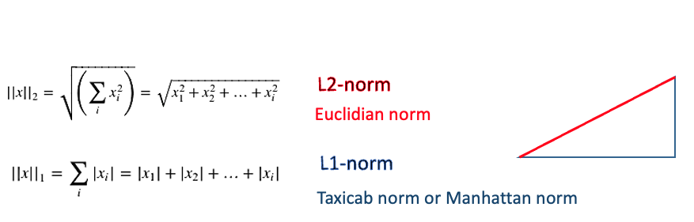

```{r setup, include=F}
knitr::opts_chunk$set(
	message = T,
	warning = T,
	#include = FALSE,
	echo = TRUE
)
if (!require("pacman")){
  install.packages("pacman", repos = 'http://cran.us.r-project.org')
} # a nice package to load several packages simultaneously


p_load("tidyverse","magrittr","broom",        #manipulate data
       "cleaR",                               #clearing workspace
       "here",                                #directory managment
       "Synth", "gsynth",                     #synthetic control
       "panelView", "lme4", "estimatr",       #multi-level model
       "gtsummary")                           #for tables

p_load("flextable",                         # For tidying up regression output
        "broom.mixed",                      # For tidying up multilevel output
        "kableExtra",                       # For nice tables
        "knitr",                            # For nice tables
        "rmarkdown")   

p_load_gh("datalorax/equatiomatic")         # For nicely presenting regression coefficients

```

# Loading the data  

Let's load the data   

```{r load_data, warning=F, message=F}
mydata <- read_csv(here("data", "sim_data.csv"))
```

You can either use the data that we modified before in part 1 or you can modify the
the raw data here   

```{r }
year_policy <- 2000

mydata <- mydata %>% 
  mutate(year_rec = year - year_policy,
         post     = ifelse(year>=year_policy,1,0),
         treated  = ifelse(state %in% c("Alabama",  "Alaska", 
                                        "Arizona", "Arkansas", "California"), 1,0),
         treatedpost = treated*post)
```


# Traditional Synthetic Control Method (Abadie)  

The data needs to be a data.frame (as opposed to a tibble)  to be able to be used in the `Synth` package. To that extent one can use the `as.data.frame()` command  


```{r abadie_scm}

mydata <- mydata %>% 
  mutate(year_rec = as.integer(year_rec)) %>%
  as.data.frame() # need to convert to a data.frame for some function to work

# create a list of treated states
list_int <- mydata %>% 
  filter(treated==1) %>% 
  select(state_num) %>% 
  distinct() %>% 
  as.matrix() %>% 
  as.vector()
list_int

# create a list of control states
list_control <- mydata %>% 
  filter(treated==0) %>% 
  select(state_num) %>% 
  distinct() %>% 
  as.matrix() %>% 
  as.vector()
list_control

# create some handy object to be used in the Synth package
year_start  = 1961
year_end    = 2010
year_policy = 2000
year_policy_prior = year_policy - 1
```


## Step 1: Prep the data  
```{r prep_abadie}

p_load("Synth")
dataprep.out <-
  dataprep(foo = mydata,
           predictors = c("xit"), #include time-varying and unit-varying variables
           predictors.op = "mean",
           dependent     = "y",
           unit.variable = "state_num",
           time.variable = "year",
           unit.names.variable = "state",
           treatment.identifier  = 1, #cannot be several states
           controls.identifier   = list_control,
           time.predictors.prior = c(year_start:year_policy_prior),
           time.optimize.ssr     = c(year_start:year_policy_prior),
           time.plot             = c(year_start:year_end))
```


## Step 2: Obtain the weights
```{r prep_scm}

#-Run the Synth command
synth.out <- synth(dataprep.out)

#Get result tables
print(synth.tables   <- synth.tab(
  dataprep.res = dataprep.out,
  synth.res    = synth.out)
)

#See thee weights
round(synth.out$solution.w,2)
sum(synth.out$solution.w)
```


## Step 3: Obtain the estimate using a DID  

```{r did3}
##--Estimate the average (weighted) outcome in the synthetic control prior to the policy

y_ctrl_pre <- dataprep.out$Y0plot%*%synth.out$solution.w %>% 
  as.data.frame() %>% 
  rownames_to_column(var="year") %>% 
  rename(control=w.weight) %>% 
  filter(year %in% c(year_start:year_policy_prior)) %>% 
  group_by() %>% 
  summarise(mean=mean(control)) %>% 
  as.matrix() %>% 
  as.vector()
y_ctrl_pre

##--Estimate the average (weighted) outcome in the synthetic control after the policy
y_ctrl_post <- dataprep.out$Y0plot%*%synth.out$solution.w %>% 
  as.data.frame() %>% 
  rownames_to_column(var="year") %>% 
  rename(control=w.weight) %>% 
  filter(year %in% c(year_policy:year_end)) %>% 
  group_by() %>% 
  summarise(mean=mean(control)) %>% 
  as.matrix() %>% 
  as.vector()
y_ctrl_post

##--Estimate the average outcome in the treated state prior to the policy
y_treat_pre <- dataprep.out$Y1plot %>% 
  as.data.frame() %>% 
  rownames_to_column(var="year") %>% 
  rename(treated=`1`) %>% 
  filter(year %in% c(year_start:year_policy_prior)) %>% 
  group_by() %>% 
  summarise(mean=mean(treated)) %>% 
  as.matrix() %>% 
  as.vector()
y_treat_pre

##--Estimate the average outcome in the treated state after the policy
y_treat_post <- dataprep.out$Y1plot %>% 
  as.data.frame() %>% 
  rownames_to_column(var="year") %>% 
  rename(treated=`1`) %>% 
  filter(year %in% c(year_policy:year_end)) %>% 
  group_by() %>% 
  summarise(mean=mean(treated)) %>% 
  as.matrix() %>% 
  as.vector()
y_treat_post 


##--Estimate a simple difference-in-difference
diff_post = y_treat_post - y_ctrl_post
diff_pre = y_treat_pre - y_ctrl_pre
diff_pre

DID = diff_post - diff_pre
DID
```

## Step 4: Plot the results  

```{r plot4}
##--Plot treated and synthetic state
path.plot(synth.res    = synth.out,
          dataprep.res = dataprep.out,
          Ylab         = c("Y"),
          Xlab         = c("Year"),
          Legend.position = c("topleft"))

abline(v   = year_policy,
       lty = 2)

##--Plot gap between treated and synthetic state
gaps.plot(synth.res    = synth.out,
          dataprep.res = dataprep.out,
          Ylab         = c("Gap"),
          Xlab         = c("Year"),
          Main         = ""
)
abline(v   = year_policy,
       lty = 2)


```
Now were going to see how to this manually

#  Preliminary notions (regression modeling through matrix multiplication and optimization)  



```{r prelim}
#simulate some data
set.seed(1)
x <- matrix(rbinom(1000, 1, prob=0.3), nrow=100, ncol=1, byrow=T)
y <- matrix(rnorm(1000, 2 + 3*x, sd=1), nrow=100, ncol=1, byrow=F)
int <- rep(1,length(y))
xint <- cbind(int,x)
xint

#Method 1: Ordinary Least Squares (OLS) through simple linear regression
mod1 <- lm(y~x)
tidy(mod1)

#Method 2: Ordinary Least Squares (OLS) through optimzation
p_load("CVXR")
n <- ncol(xint)
beta <- Variable(n)
objective <- Minimize(p_norm((y - xint%*%beta), p=2))
prob <- Problem(objective)
CVXR_result <- solve(prob)
cvxrBeta <- CVXR_result$getValue(beta) 
cvxrBeta
```


# Manual Synthetic Control Method  

## Step 1: Aggregate data by state, treated and post and transpose the data to obtain a unique row per state  

```{r step1}
df00 <- mydata %>%
  select(state, treated, post,
         xit, xt, xi, y) %>% 
  group_by(state, treated, post) %>% 
  group_modify(~ {.x %>% map_dfr(mean)}) %>% #short way to get the aggregated mean
  pivot_wider(names_from = post, 
              names_sep = "_",
              values_from = c(treated,
                              xit, xt, xi, y)) %>% 
  ungroup() %>% 
  rename(treated=treated_0) %>% 
  select(-c(treated_1)) %>% 
  mutate(y_diff = y_1 - y_0)

df00 %>% 
  paged_table()
```

## Step 2: Obtain the weights through optimization  

```{r step2}
p_load("CVXR") #optimization package: convex optimzation

##--Obtaining the value of the xit variable for treated and control
cov_treat <- df00 %>% 
  ungroup() %>% 
  filter(state=="Alabama") %>% #to do one treated state at a time
  select(xit_0) %>% 
  as.matrix() %>% 
  t()
cov_treat

dim(cov_treat)
cov_treat %>% t()

cov_ctrl <- df00 %>% 
  ungroup() %>% 
  filter(treated==0) %>% 
  select(xit_0) %>% 
  as.matrix() %>% 
  t()

cov_ctrl

dim(cov_ctrl)
cov_ctrl %>% t()
```

**obtaining the weights through optimization**
The SCM is formed by finding the vector of weights `W`
that minimizes the imbalance between the treated unit and 
weighted average of the controls across a set of variables
 `C` (e.g. pre-intervention covariates)
Essentially, in a SCM we try to find W such that 
$(C_{1} - C_{0}W)'V(C_1- C_0W)$ is minimized
`W` being positive and summing to 1 to avoid extrapolating (Abadie et al 2010). 

```{r}
v <- Variable(c(ncol(cov_ctrl), ncol(cov_treat)))
obj <- p_norm((cov_treat - cov_ctrl%*%v), p=2)
#obj <- norm2(cov_treat - cov_ctrl%*%v) #same as above
objective <- Minimize(obj)
prob <- Problem(objective, list(v>=0, sum(v)==1)) #we add in the constraints
CVXR_result <- solve(prob)
synth_weights <- CVXR_result$getValue(v)
round(synth_weights,3)

##--comparing the weights with those of the synthetic control package
cbind(round(synth_weights,3), synth.tables$tab.w)
```


## Step 3: Applying the weights to check covariate balance

```{r step3}
#the difference in covariates after applying the weights is essentially 0 as
# expected before the policy
cov_treat - weighted.mean(as.numeric(cov_ctrl), w = synth_weights)
cov_treat - cov_ctrl%*%synth_weights #same as above
```

## Step 4: Implemented the DID 

```{r step4}
y_treat_post <- df00 %>% 
  ungroup() %>% 
  filter(state=="Alabama") %>% #to do one treated state at a time
  select(y_1) %>% 
  as.matrix() %>% 
  as.vector()
y_treat_post

y_ctrl_post <- df00 %>% 
  ungroup() %>% 
  filter(treated==0) %>% 
  select(y_1) %>% 
  as.matrix() %>% 
  as.vector()
y_ctrl_post


y_treat_pre <- df00 %>% 
  ungroup() %>% 
  filter(state=="Alabama") %>% #to do one treated state at a time
  select(y_0) %>% 
  as.matrix() %>% 
  as.vector()
y_treat_pre

y_ctrl_pre <- df00 %>% 
  ungroup() %>% 
  filter(treated==0) %>% 
  select(y_0) %>% 
  as.matrix() %>% 
  as.vector()
y_ctrl_pre


diff_post = y_treat_post - weighted.mean(y_ctrl_post, w = synth_weights)
#diff_post = y_treat_post - y_ctrl_post%*%synth_weights
diff_post


diff_pre = y_treat_pre - weighted.mean(y_ctrl_pre, w = synth_weights)
#diff_pre = y_treat_pre - y_ctrl_pre%*%synth_weights
diff_pre

DID = diff_post - diff_pre
DID

#Alternatively we can do the following
DID1 <- (weighted.mean(y_treat_post, w = 1) - 
           weighted.mean(y_ctrl_post, w = synth_weights)) - 
  
  (weighted.mean(y_treat_pre, w = 1) - 
     weighted.mean(y_ctrl_pre, w = synth_weights))
DID1
```


## Step 5:Or fit a weighted regression model
```{r reg_scm}
myweights <- c(1, synth_weights) # weight of 1 for the treated group
myweights %>% 
  kable()

df00a <- df00 %>% 
  filter(state=="Alabama" | treated == 0) %>% 
  mutate(weights = myweights) 

paged_table(head(df00a,20))

#Crude model
res_model <- glm(y_diff ~ treated , family=gaussian("identity"), 
                 data=df00a)
tidy(res_model) %>% mutate_if(is.numeric, round, 2) %>% flextable()

#Conditional adjusted Model without weighting
res_model <- glm(y_diff ~ treated + xit_0 , family=gaussian("identity"), 
                 data=df00a)
tidy(res_model) %>% mutate_if(is.numeric, round, 2) %>% flextable()

#Marginal adjusted Model with weighting 
res_model <- glm(y_diff ~ treated, family=gaussian("identity"), 
                 data=df00a, weights = myweights)
tidy(res_model) %>% mutate_if(is.numeric, round, 2) %>% flextable()
#Point estimate is correct but standard error are not: need to use other
#method e.g. bootstrap
```


# Generalized Synthetic Control  
For more information about the generalized synthetic control method. You can check out the paper [here](https://www.cambridge.org/core/journals/political-analysis/article/generalized-synthetic-control-method-causal-inference-with-interactive-fixed-effects-models/B63A8BD7C239DD4141C67DA10CD0E4F3).
A nice tutorial can be found [here](https://yiqingxu.org/packages/gsynth/articles/tutorial.html)  


```{r gscm}
p_load("gsynth")
y <- gsynth(y ~ treatedpost + xit, 
            data = mydata,  EM = F, index = c("state","year"), 
            inference = "parametric", se = TRUE,
            nboots = 2,  #change to >=200 for better results
            r = c(0, 5), CV = TRUE, force = "two-way", parallel = FALSE)
y1 <- round(data.frame(y$est.avg),2)
y1

plot(y)
plot(y, type = "counterfactual", raw = "none", main="")
plot(y, type = "counterfactual", raw = "all")
plot(y, type = "ct", raw = "none", main = "", shade.post = FALSE)
```


# Augmented Synthetic control 
For more information about the augmented synthetic control method. You can check out the paper 
[here](https://www.tandfonline.com/doi/abs/10.1080/01621459.2021.1929245?journalCode=uasa20) 
A nice tutorial can be found
[here](https://github.com/ebenmichael/augsynth/blob/master/vignettes/singlesynth-vignette.md)

```{r ascm}
# ## Install devtools if noy already installed
# install.packages("devtools", repos='http://cran.us.r-project.org')
# Install augsynth from github
# devtools::install_github("ebenmichael/augsynth")

p_load_gh("ebenmichael/augsynth")
set.seed(123)
augsynth.scm <-augsynth(y ~ treatedpost | xit,
                        unit = state, 
                        time = year, 
                        data = mydata, 
                        #t_int = 2000, #not necessary to add
                        fixedeff = T,
                        progfunc="Ridge", scm=T)
#progfunc = None for Traditional SCM,
#progfunc = Ridge for Ridge regression or augmented SCM
#progfunc = GSYN for the Generalized SCM

augsynth.scm

augsynth.scm$weights
#weights are not necessarily positive

augsynth.scm$l2_imbalance
#the overall imbalance between the two groups

res <- summary(augsynth.scm, inf = T, 
        inf_type = "jackknife+", #algorithm over time periods
        linear_effect = T)
res

y2 <- res$average_att
y2

plot_aug <- plot(augsynth.scm)
plot_aug

```

